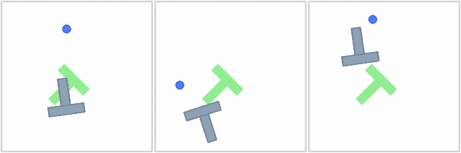

# Offline RL with LeWorldModel

### Can a policy be improved inside a JEPA world model, without touching the environment?

Deep Learning Lab project, University of Freiburg, SoSe 2026

This repository is the codebase for training and evaluating PushT policies on top of a frozen
[LeWorldModel](https://github.com/lucas-maes/le-wm) (LeWM). It trains a latent behavioural-cloning policy and then fine-tunes it with PPO using rollouts either from the PushT simulator or from LeWM’s imagined dynamics.

The repository also contains the bridges and probes needed to turn imagined latents into policy
inputs, rewards, and termination signals, plus one shared evaluator for comparing BC, real-PPO, and
dream-PPO checkpoints.

<p align="center">
  <b>[ <a href="https://docs.google.com/presentation/d/1-oNcFspcV0CBroVyhtFS_ti9GM_A7fOuP8SgzajbwqY/edit?usp=sharing">Poster</a> | <a href="https://huggingface.co/offline-rl-with-le-wm">Checkpoints</a> | <a href="https://github.com/lucas-maes/le-wm">LeWM</a> | <a href="https://le-wm.github.io/">LeWM website</a> ]</b>
</p>

## PushT environment

PushT is a planar manipulation task in which a circular end effector must push a T-shaped block
into the green target pose. The policy observes rendered images and controls the end effector
through target positions; success requires aligning the block with the target. The episodes below
are successful demonstrations from the expert trajectory dataset used for behavioural cloning.

<p align="center">
  
  <br>
  <em>Successful PushT expert demonstrations.</em>
</p>

## How it works

LeWM's ViT and projector remain frozen throughout training. Policies consume either raw CLS tokens
or projected LeWM dynamics latents, stacked over a dilated frame history.

```text
expert frames -> frozen ViT -> raw CLS --------> raw-CLS BC/PPO
                                  |
                                  +-> frozen projector -> projected BC/PPO

expert context + actions -> frozen predictor -> imagined projected latent
                                                    |
                         +--------------------------+-----------------------+
                         |                                                  |
              projected policy directly                    decoder / de-projector
                                                                    |
                                                               raw-CLS policy
```

- [`src/bc/train_bc_latent.py`](src/bc/train_bc_latent.py) trains the action-chunked latent BC prior.
- [`src/ppo/train.py`](src/ppo/train.py) improves that prior with PPO in `swm/PushT-v1`.
- [`src/ppo/train_lewm.py`](src/ppo/train_lewm.py) runs the same PPO update on imagined LeWM
  rollouts without calling `env.step` during training.
- [`src/evaluation/evaluate_pusht.py`](src/evaluation/evaluate_pusht.py) evaluates every agent in the
  real environment under the same protocol.

## Setup

```bash
python -m venv .venv
source .venv/bin/activate
pip install -r requirements.txt          # requirements-macos.txt on Apple silicon
cp .env.example .env
```

Clone LeWM next to this repository, or set `LE_WM_PATH` in `.env` to its location. Then download the
pretrained PushT encoder and expert demonstrations:

```bash
python -m scripts.download_lewm_checkpoint
python scripts/download_pusht_data.py
```

Dream PPO additionally expects LeWM's HDF5 expert dataset at
`le-wm/models/datasets/pusht_expert_train.h5`, a success probe under
`models/probes/pusht_lewm/`, and either a decoder or de-projector bridge. These paths can be changed
with `--dataset-path`, `--probe-dir`, and the corresponding bridge checkpoint argument. Published
artifacts are available from the [checkpoint collection](https://huggingface.co/offline-rl-with-le-wm).

## Prepare the expert dataset

The downloaded demonstrations contain 96×96 images. Re-render their recorded simulator states at
LeWM's native 224×224 resolution before training BC:

```bash
python scripts/regenerate_pusht_expert.py \
  --dataset data/expert_trajectories/pusht_expert.npz \
  --output-dataset data/expert_trajectories/pusht_expert_224.npz \
  --verify-n 100
```

The generator uses a disk-backed image buffer. Allow space for both the temporary buffer and output
dataset, or add `--compressed` to reduce the final file size.

## Train a behavioural-cloning prior

```bash
python -m src.bc.train_bc_latent \
  --data_path data/expert_trajectories/pusht_expert_224.npz \
  --checkpoint_path runs/bc/pusht_latent_bc.pth \
  --latent-representation projected \
  --epochs 100 \
  --batch_size 64 \
  --hidden_dim 256 \
  --frame_stack 3 \
  --frame_stride 5 \
  --action_chunk_size 5 \
  --eval_interval 10 \
  --eval_episodes 20 \
  --eval_seed 42
```

Training writes `pusht_latent_bc_best.pth` and `pusht_latent_bc_final.pth` beside the base checkpoint,
with matching `_stats.pth` files. To train a policy in the image encoding space , instead of
in LeWM's projected dynamics space, add `--latent-representation rawcls`; the saved stats ensure
PPO restores the matching representation. Note that when fine-tuning the policy with PPO later, both `--latent-representation` options utilize the LeWM dynamics space. The difference is that in the `rawcls` option, LeWM latents are deprojected back into the image encoding space to before being used by PPO.

## Improve the policy with PPO

Both PPO entry points start from the same BC checkpoint and stats file. Use local BC artifacts from
the previous step, or replace them with `hf://` paths from the checkpoint collection.

### PPO in the real environment

```bash
python -m src.ppo.train \
  --exp-name pusht_real_ppo \
  --checkpoint_path runs/ppo/pusht_real_ppo.pt \
  --bc-checkpoint runs/bc/pusht_latent_bc_best.pth \
  --bc-stats runs/bc/pusht_latent_bc_best_stats.pth \
  --fixed-target \
  --reward-mode sparse \
  --block-start-near-goal \
  --block-start-radius 200 \
  --total-timesteps 1000000 \
  --num-envs 8 \
  --num-chunks 64 \
  --eval-interval 10
```

`--checkpoint_path` is a base name: this run writes `pusht_real_ppo_best.pt`,
`pusht_real_ppo_final.pt`, and related artifacts under `runs/ppo/`. If the option is omitted, PPO
retains its timestamped layout under `<save-dir>/<experiment>__seed<N>/<timestamp>/`.

### PPO inside LeWM

```bash
python -m src.ppo.train_lewm \
  --exp-name pusht_dream_ppo \
  --checkpoint_path runs/ppo/pusht_dream_ppo.pt \
  --bc-checkpoint runs/bc/pusht_latent_bc_best.pth \
  --bc-stats runs/bc/pusht_latent_bc_best_stats.pth \
  --fixed-target \
  --reward-mode sparse \
  --block-start-near-goal \
  --block-start-radius 200 \
  --bridge deprojector \
  --total-timesteps 1000000 \
  --num-envs 8 \
  --num-chunks 64 \
  --eval-interval 0 \
  --selection dream \
  --dream-eval-interval 25 \
  --dream-eval-episodes 96
```

With `--selection dream`, held-out expert episodes select the best checkpoint without simulator
evaluation.
For a raw-CLS policy, `--bridge` may be `decoder` or `deprojector`. A projected BC policy consumes
the predictor output directly and does not use either bridge.

Multi-arm and multi-seed launchers are available under [`scripts/campaign/`](scripts/campaign/).

## Evaluate a checkpoint

Use the environment-owned evaluator for both BC and PPO agents. For BC, supply the matching stats
file:

```bash
python -m src.evaluation.evaluate_pusht \
  --agent-type bc \
  --checkpoint runs/bc/pusht_latent_bc_best.pth \
  --stats runs/bc/pusht_latent_bc_best_stats.pth \
  --block-start-radius 200 \
  --episodes 150 \
  --max-episode-steps 300 \
  --seed 42 \
  --video
```

For a PPO checkpoint, point `--checkpoint` at the selected artifact:

```bash
python -m src.evaluation.evaluate_pusht \
  --agent-type ppo \
  --checkpoint runs/ppo/pusht_real_ppo_best.pt \
  --block-start-radius 200 \
  --episodes 150 \
  --max-episode-steps 300 \
  --seed 42 \
  --video
```

Each evaluation creates a timestamped directory under `runs/evaluations/`. `metrics.json` records
the sampled episode seeds, configuration, rewards, and success rate; `--video` also writes episode
videos. Omitting `--block-start-radius` evaluates unrestricted block starts around the fixed target.

## Optional logging and publishing

Training saves locally by default. Set `WANDB_API_KEY` and/or `HF_TOKEN` in `.env` only when using
these integrations, then append the relevant flags:

```bash
# Behavioural cloning logging
--wandb --wandb_project YOUR_WANDB_PROJECT --wandb_run_name YOUR_RUN_NAME

# Real or dream PPO logging
--track --wandb_project YOUR_WANDB_PROJECT

# Behavioural cloning or PPO artifact publishing
--push_to_hf --hf_repo_id YOUR_USERNAME/YOUR_REPO --hf_path_prefix YOUR_RUN_NAME
```

The CLI also accepts published artifacts as
`hf://OWNER/REPOSITORY/PATH/TO/CHECKPOINT` wherever a checkpoint path is expected.

## Probing, decoding, and rollout analyses

The PushT LeWM analysis utilities live under `scripts/` and are launched from the
repository root with `python -m`. Every script exposes its full CLI with
`--help`, and relative paths are resolved from the repository root.

State probes decode task variables from frozen LeWM latents. Use
`--probes all` or select specific heads such as `agent_pos`, `block_pos`,
`block_angle`, `block_rel_objective`, `block_rel_agent`, and `objective_met`.

```bash
python -m scripts.probes.train_state \
  --probes all \
  --latent-cache models/probes/pusht_lewm_1M/latents.npz \
  --output-dir models/probes/pusht_lewm_1M

python -m scripts.rollouts.state_probes \
  --probe-dir models/probes/pusht_lewm_1M \
  --probe-kind mlp \
  --horizon 40
```

The sparse reward classifier is the `objective_met` probe with a dedicated
entrypoint. It uses the same trajectory-aware splits and latent cache as
`train_state`, but trains only `objective_met`. It can train on encoded dataset
latents only, or mix in LeWM imagined rollout latents generated with
ground-truth actions. For reward use, prefer selecting the deployed threshold by
target false-positive rate, optionally using imagined validation rollouts as the
threshold source.

```bash
python -m scripts.probes.train_sparse_reward \
  --latent-cache models/probes/pusht_lewm_1M/latents.npz \
  --output-dir models/probes/pusht_sparse_reward \
  --max-samples 1000000 \
  --include-imagined-rollouts \
  --imagined-fraction 0.5 \
  --imagined-rollout-horizon 20 \
  --eval-imagined-rollouts \
  --threshold-policy target_fpr \
  --target-fpr 0.05 \
  --threshold-source imagined_val \
  --hard-negative-mining \
  --hard-negative-fraction 0.25 \
  --hard-negative-epochs 10 \
  --device cuda

python -m scripts.rewards.sparse_reliability \
  --probe-dir models/probes/pusht_sparse_reward \
  --probe-kind mlp \
  --horizon 20
```

Dense reward training predicts whether success will occur within several future
world-model horizons, defaulting to `2 5 10 16`. Useful controls are
`--include-imagined-rollouts`, `--imagined-fraction`, `--hard-negative-mining`,
`--target-fpr`, and `--monotonic-outputs`. The imagined-rollout options mix
encoded dataset latents with LeWM rollout latents generated from ground-truth
actions; this is useful when the reward will be consumed inside imagined PPO.
The FPR and hard-negative options are for making positive dense heads less
trigger-happy when false positives would create exploitable reward.

```bash
python -m scripts.probes.train_dense_reward \
  --latent-cache models/probes/pusht_lewm_1M/latents.npz \
  --output-dir models/probes/pusht_dense_reward \
  --horizons 2 5 10 16 \
  --include-imagined-rollouts \
  --imagined-fraction 0.5 \
  --imagined-rollout-horizon 20 \
  --device cuda

python -m scripts.rewards.dense_reliability \
  --dense-reward-checkpoint models/probes/pusht_dense_reward/dense_reward_classifier.pt
```

Decoder scripts train a diagnostic latent-to-image decoder and visualize decoded
LeWM imagination against ground-truth futures:

```bash
python -m scripts.decoder.train \
  --output-dir models/latent_decoder/pusht_lewm

python -m scripts.decoder.gt_rollout_video \
  --decoder-checkpoint models/latent_decoder/pusht_lewm/decoder_best.pt \
  --horizon 10
```

Noisy-action and perturbation analyses stress the world model away from clean
expert futures. `noisy_actions visualize` makes side-by-side decoded-vs-simulated
videos; `evaluate_rollouts` skips videos and plots probe errors over action
noise. `--plot-existing` regenerates plots from existing CSVs without rerunning
LeWM.

```bash
python -m scripts.rollouts.noisy_actions evaluate_rollouts \
  --probe-dir models/probes/pusht_lewm_1M \
  --probe-kind mlp \
  --noise-stds 0,0.05,0.1,0.2,0.4

python -m scripts.probes.train_perturbation_invariant \
  --perturbations all \
  --consistency-weight 0.5

python -m scripts.rollouts.perturbations \
  --probe-dir models/probes/pusht_lewm_invariant \
  --probe-kind mlp
```

Noisy-action probes can be trained from encoded simulator futures, imagined
rollout latents, or a mixture. If the HDF5 dataset is missing,
`train_noisy_actions` calls the dataset generator with matching generation args.

```bash
python -m scripts.data.noisy_actions_dataset \
  --output models/probes/pusht_noisy_actions/noisy_action_dataset.h5 \
  --num-trajectories 512 \
  --horizon 50 \
  --noise-stds 0,0.05,0.1,0.2,0.4

python -m scripts.probes.train_noisy_actions \
  --dataset models/probes/pusht_noisy_actions/noisy_action_dataset.h5 \
  --training-sources direct_and_imagined \
  --imagined-fraction 0.5
```

## Repository layout

```text
src/representations/   frozen LeWM encoder and latent bridges
src/bc/                latent behavioural cloning
src/ppo/               real-environment and imagined PPO
src/evaluation/        shared PushT evaluation protocol
src/envs/              PushT environment wrappers
scripts/campaign/      multi-arm and multi-seed launchers
scripts/probes/        state, sparse-reward, dense-reward, invariant, and noisy-action probe training
scripts/rewards/       sparse and dense reward classifier rollout reliability analyses
scripts/rollouts/      state-probe, noisy-action, and perturbation rollout analyses
scripts/decoder/       latent image decoder training and decoded rollout videos
scripts/data/          auxiliary dataset generation scripts
scripts/deprojector/   bridge training and diagnostics
scripts/rq1/, rq2/     experiment analysis utilities
scripts/ablations/     representation and robustness studies
```

## Acknowledgements

We thank our supervisor [Akshay L Chandra](https://github.com/acl21) for his guidance and support.

Built on [LeWorldModel](https://github.com/lucas-maes/le-wm) by Lucas Maes, Quentin Le Lidec, Damien
Scieur, Yann LeCun, and Randall Balestriero, and on
[stable-worldmodel](https://github.com/galilai-group/stable-worldmodel) for environment management
and evaluation. The PushT expert demonstrations come from
[Diffusion Policy](https://diffusion-policy.cs.columbia.edu/).
